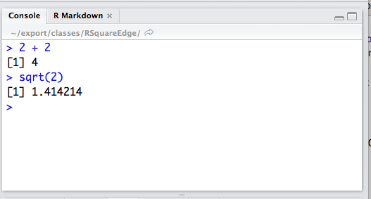

John Verzani, `jverzani@gmail.com`

# What is R?

From its [homepage](https://www.r-project.org/):

> R is a free software environment for statistical computing and graphics. It compiles and runs on a wide variety of UNIX platforms, Windows and MacOS.


## The R environment

And more detail is given [here](https://www.r-project.org/about.html):

R is an integrated suite of software facilities for data manipulation, calculation and graphical display. It includes

* an effective data handling and storage facility,
* a suite of operators for calculations on arrays, in particular matrices,
* a large, coherent, integrated collection of intermediate tools for data analysis,
graphical facilities for data analysis and display either on-screen or on hardcopy, and
* a well-developed, simple and effective programming language which includes conditionals, loops, user-defined recursive functions and input and output facilities.

----

The term “environment” is intended to characterize it as a fully planned and coherent system, rather than an incremental accretion of very specific and inflexible tools, as is frequently the case with other data analysis software.

...

Many users think of R as a statistics system. We prefer to think of it of an environment within which statistical techniques are implemented. R can be extended (easily) via packages. There are about eight packages supplied with the R distribution and many more are available through the CRAN family of Internet sites covering a very wide range of modern statistics.

## How big is R?

Kaiser mentioned that I could cover material from a talk given in 2005. In reviewing that I saw that R had about 400 add-on packages. Today it is over 7000. It has between 1 and 2 million users. It is used by several companies, such as the New York Times (where R based graphics appear with some frequency).


## Our goals for these two sessions

We intend to cover topics on data and manipulations of data.

Some (free and not free) resources for this material:

* Through chapter 5 in [UsingR for Introductory Statistics](http://www.amazon.com/Introductory-Statistics-Second-Edition-Chapman/dp/1466590734)


* The beginning of [My ASA notes](http://wiener.math.csi.cuny.edu/verzani/R/ASA-24-May-2005.pdf)

* [DataCamp: Intro to R](https://campus.datacamp.com/courses/free-introduction-to-r/chapter-1-intro-to-basics-1?ex=2&open_outline=true)

* [DataCamp: Intermediate R](https://campus.datacamp.com/courses/intermediate-r/chapter-1-conditionals-and-control-flow?ex=1)

* Hadley Wickham's [Advanced R](http://adv-r.had.co.nz/)


## Getting started with R

We need to get our R environment set up. Thankfully it is pretty easy:

* install R

Instructions are [here](https://cran.r-project.org/)

* install RStudio (optional but a great place to start)

Instructions are [here](https://www.rstudio.com/)

## Issuing commands in RStudio

Commands are issued in the console:



----

In these notes, the commands look like this:

```{r}
2 + 2
```

```{r}
sqrt(2)
```

The `##` bits are not printed out in the console, but rather are inserted by the presentation software

----

Assignment: Computer languages use the equals sign differently than math expressions. In computer languages they are assignment:

```{r}
x = 2
```

This assigns the label `x` to the value `2`. Here, the math interpretation is the same, but not here:

```{r}
x = x + 2
```

To clarify the distinction, R has a different syntax for assignment available:

```{r}
x <- x + 2
```

## Packages

Base R is a pretty rich programming environment in itself. However, it is designed to be extended by others. A few reasons why:

* R's base is maintained by a really small group of people. There is no way they could write all the functionality that users desire. By making it extendable, the core can be small and quick, and yet provide a platform that can be extensive. Even base R is comprised of a small handful of packages. Such as, extra plotting (`lattice`), extra statstical functionality (`MASS`), GUI enhancements (`tcltk`)...

* R's base language was  developed over many years (starting with S in the 80s). As such, it can be a bit inconsistent and feel dated. There are a number of packages that bring in more modern programming styles into R.


----

To illustrate, we can install the *external* `dplyr` package, which extends functionality related to data frames, with a command like:

```
install.packages("dplyr")
```

This command would find the package from a [CRAN](cran.r-project.org)
repository and install it.


----

In RStudio we can use the interface


----

* Once a package is installed it can be used. Installation (and upgrading) happen only every so often. Using a package may be common. To use a package, we need to load it from the library of packages:

```{r}
library(dplyr)
```


## Outline

Okay, with these preliminaries out of the way, the plan is to talk about 3 things:

* Different types of data

* Different types of containers for data

* Different ways to slice and dice these containers to analyze the data.

