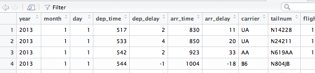

## Manipulating Data Containers

Storing data sets in data frames is very convenient, but with just the indexing notation, can make for cumbersome tasks. 

Consider the following question (from UsingR): For the `normtemp` dataset perform a `t.test` for temperature by gender.


```{r}
normtemp <- UsingR::normtemp
```

(No need to install `UsingR` -- it is used just for this example.)
----

The data looks like:

```{r}
head(normtemp)
```

----

We see gender is coded. The docs say 1 for male 2 for female. Here we split the data to perform a "t test":

```{r}
males   <- normtemp[normtemp$gender == 1, "temperature"]
females <- normtemp[normtemp$gender == 2, "temperature"]
t.test(males, females)
```

----

Great, it appears there is a statististically significant difference in body temperature between male and females.

But why did this take take so much typing for something which seems simple: split the data and apply some function.

For R's modeling functions, like `t.test`, there is a syntax -- the  model formula -- that is used to describe such tasks:

```{r}
t.test(temperature ~ gender, data=normtemp)
```

----

The expression/model formula 

`temperature ~ gender` 

means roughly "model temperature
by the gender variable and apply the `t.test` to it. The code in
`t.test` then splits the data by the `gender` variable, checks that
this leaves 2 levels, and if so calls the `t.test` function in the
more verbose manner.


----

The combination of R's model formula and its use of polymorphism (different methods can be called for different types of data usin g the same name) can bring easy-to-type, yet very expressive commands. Plotting is a good example. Here we see two different types of plots, as the two formulas represent different types of models:

----

```{r}
plot(hr ~ temperature, data=normtemp)
```

----

```{r}
plot(hr ~ factor(gender), data=normtemp)
```


----

That's good for this function. But what about a lower level task:
finding the mean or standard deviation of a group? For these actions the model
formula is not defined. As such, it is helpful to develop some basic data
massaging tools related to data frames:

* subsetting (filtering) values
* reduction (selecting) variables to consider
* applying a function over a container
* grouping or splitting by values
* applying a function to groups of values

For these tasks we illustrate a few solutions, both with base `R` and with add-on packages.

## Exploring a data set

We will illustrate with two data sets, one modest, the other large

```{r}
library(nycflights13)   # install.packages("nycflights13") is needed at some point
library(MASS)           # Built in package
dim(flights)            # large
dim(Cars93)             # modest
```

What do we have?

----

In RStudio, a data frame can be shown in a (non-editable)
table. Typically this involves just clicking on their entry in the
"Environment" tab. But as these data sets come from built-in data sets, an extra
step is needed to make them show up. The following looks silly, but it
actually makes a copy in the current workspace:

```{r}
flights <- flights
Cars93 <- Cars93
```

---- 

Now double clicking will open up a window like



----

There are times where we still want summaries without a graphical view. Here we have:

```{r}
dim(flights)    # dimensions, also nrow, length
names(flights)   # also colnames
summary(flights)
```


## Subsetting, Filtering of vectors

What flights are JetBlue? We can see that the `carrier` variable is coded:

```{r}
table(flights$carrier)
```

---- 

Looking at the referenced `airlines` data set, we see that `B6` is JetBlue. How to get just those flights? There are several ways:

```{r}
jb <- flights[flights$carrier == "B6",]   # base indexing
jb <- with(flights, flights[carrier=="B6", ]) # using with
jb <- subset(flights, carrier == "B6")    # new function
```

The shortest -- by a hair -- is the use of `subset`. This is a
convenience function. Rather than describe that function, we mention a
similar one from the `dplyr` package.

## Subsetting, Filtering data frames using `dplyr`

The `dplyr` package provides some higher-level interfaces to
indexing. For this task -- filtering our cases -- we have the `filter`
function.

First, we load the package:

```{r}
library(dplyr)   # ignore the many comments...
```

----

Here is `dplyr`'s alternative:

```{r}
jb <- filter(flights, carrier == "B6")
```

About the same as `subset`, but we can make our queries much more involved:

```{r}
jb <- filter(flights, carrier == "B6", origin == "JFK")
```

In the above, values get combined with `&`.

To use "ors", we can explicitly use `|`:

```{r}
jb <- filter(flights, carrier == "B6" | origin == "JFK")
```

(But not `&&` or `||` here, a common mistake)

----

Some other examples. What flights went over midnight?

Assuming the flights weren't over 24 hours, these would be flights whose arrival time is less than the depature time:

```{r}
red_eyes <- filter(flights, dep_time > arr_time)
nrow(red_eyes) / nrow(flights)
```

What flights do not have a recorded air time?

```{r}
no_air <- filter(flights, is.na(flights$air_time))
dim(no_air)
```

----

Did any flights just turn around? (no)

```{r}
filter(flights, origin == dest)
```

## Reducing the number of variables

The `Cars93` data set has 27 variables. Suppose we only wanted to
consider a selection of them. We can put in indices into the column
position:

```{r}
a <- Cars93[, c(1, 2, 11, 12, 13,14)]
```

This can also use names for clarity:

```{r}
nms <- names(Cars93)[c(1, 2, 11, 12, 13,14)]  # or type ...
nms
a <- Cars93[, nms]
```
----

If you want all *but* a variable, negative indexing is useful.

```{r}
a <- Cars93[, -26]  
dim(a)
```
----

The `select` function of `dplyr` makes this slightly nicer if typing, as it uses non-standard evaluation of names:

```{r}
a <- dplyr::select(Cars93, Manufacturer, Model, 
            Cylinders, EngineSize, Horsepower,    RPM)
```


It can also "fill in", the above covers two sequences:

```{r}
a <- select(Cars93, Manufacturer:Model, Cylinders:RPM)
head(a)
```


----

At the **enormous** risk of confusing things, the built-in `Filter` function can also be helpful with this task. This function (note capital "F") reduces the elements of a vector or list to just those that satisfy some condition.

An example would be a means to remove variables which are not numeric:

```{r}
a <- Filter(is.numeric, Cars93)   # Filter(predicate, data)
dim(a)
```

(Warning: lower case `filter` to filter rows, upper case to `Filter` columns, in a data frame.)

## Combining operations. We can combine these tasks:

```{r}
a <- flights[flights$carrier == "B6", c("distance")]
```

The "piping" function in `dplyr` (also `magrittr`) makes chaining distinct function calls pretty easy:

```{r}
a <- filter(flights, carrier == "B6") %>% select(distance)
```

----

Chaining (composing) versus monolithic calls.

The last command could also have been done in one function call using base R's `subset` function:

```
a <- subset(flights, carrier=="B6", select=distance)
```

Which is more natural?

----

Natural,  of course, has a  personal answer, but the programming style of most *newer* R packages is to try and create single-task functions that are *orthogonal* to each other, so functions combining two tasks into one call (`subset` basically does both `filter` and `select`) is a less common thing to see.

## Applying a function over a container

Earlier we mentioned that R vectorizes function calls so that this:

```
[x1 x2 ... xn] -> [f(x1) f(x2) ... f(xn)]
```

is simply `f(x)`. (When `f` is not a reduction.)

Can we do something similar for other containers? For example, lists?

```
[[ l1 l2 ... ln ]] -> [[ f(l1) f(l2) ... f(ln) ]]
```


----

The answer is "yes". 

In general this is called a "map". R has the `Map` function, but more
commonly you'll see one of `sapply`, `lapply` or `apply`

The different names are because there are various means to apply a
function over the rows or columns of a matrix or data frame and over
components of a list.

(The popular `plyr` package has many similar functions distinguished
by the data types: `ddply`, `adply`, ...)

## sapply

Say we have data in a data frame and we want to find the mean of each numeric column. We can do this in two steps:

* get just the numeric columns (`Filter`)
* apply the mean to each remaining one (`sapply`)

```{r}
x <- Filter(is.numeric, Cars93)     # Filter(function, data)
sapply(x, mean)                     # sapply(data, function)!!!
```

(How to get rid of the NA values?)

----

Earlier we saw that `summary` can be applied to data frames. This
function also works for vectors. Calling it as follows is an
alternative:

```{r}
sapply(flights, summary)
```

----

Note that one output was a *vector*, the other a *list*. 

Part of the task of `sapply` (the "s" part) is to *simplify* the output -- when possible. 

Vectors are "simpler" than lists, so if possible the data is massaged into a vector.  

The `lapply` function always returns a list, as does `Map`.


## Basics of functions

The functions `sapply`, `Map`, `lapply`, ... are
[higher-order](https://en.wikipedia.org/wiki/Higher-order_function)
functions. For one of the arguments, we pass in a function object by
name (or anonymously). Often these functions are already defined for
us (e.g., `is.numeric`), but there are times where we would want to
define our own. For example, one way to remove NA values before
computing the mean is to set the argument `na.rm=TRUE`. It is false by
default. We could do this:

```{r}
our_mean <- function(x) mean(x, na.rm=TRUE)
```

----

Then we can use:

```{r}
sapply(Filter(is.numeric, Cars93),   our_mean)
```

----

This task of setting an argument to a function is common enough that
`sapply` permits passing these as additional arguments, so more
idiomatically we would have:

```
sapply(Filter(is.numeric, Cars93),  mean, na.rm=TRUE)
```

But being able to define simple functions is very useful.

## Functions: basic

Without diving in too deeply now, the basic template for a *simple* function is just:

```
fn_name <- function(x) {
   ... do something with x ....
   ... last value evaluated is the value returned ...
}
```

In our previous example, we only have one command, so the braces were optional.


## anonymous functions

If you want to reduce typing, we can even define functions
"anonymously":

```
sapply(Filter(is.numeric, Cars93), function(x) mean(x, na.rm=TRUE))
```

That double composition gets to be too much to read, but is not so
hard to type when needed.


## splitting or grouping

We return to the motivating example: splitting and then applying some
function.

First, splitting. Base R has the command `split` that can be used to
create a list of groups defined by some factor. For example, the
`Cars93` data set has the `Origin` factor:

```{r}
by_origin <- split(Cars93, Cars93$Origin)
```

The `by_origin` variable is a list with two components: one for `USA`
and one `non-USA` -- the different levels of `Origin`. 

```{r}
names(by_origin)
```

----

If we wanted we
can apply a function to each component.

For example, here is *one* way to get the number of cases in each:

```{r}
sapply(by_origin, nrow)
```

You could argue  `table(Cars93$Origin)` is more direct for this taks, but using `sapply` is much more versatile.

----

To get the average mileage for each requires a function which takes a
data frame and returns the average of one of its variables. For that there is nothing built-in,
so we roll our own:

```{r}
sapply(by_origin, function(d) mean(d$MPG.highway))
```

(It would be nicer to just say `summarize(by_origin, mean(MPG.highway)` but that is coming.)


---- 

We can see the total distance each airplane (unique tail numbers) flew with the following chained set of commands:

```{r}
out <- split(flights, flights$tailnum) %>%
  sapply(function(d) sum(d$distance, na.rm=TRUE)) %>%
    sort(decreasing=TRUE) %>% 
      head(n=5)
out
```

---- 

What do we know about the airlines that worked these planes so hard?

```{r}
with(flights, flights[tailnum == names(out)[-1], "carrier"])
```

They were all American. (Why a data frame print out?)

----

Hmm, interesting. Can we get the distance traveled by carrier?

```{r}
out <- split(flights, flights$carrier) %>% 
  sapply(function(d) sum(d$distance, na.rm=TRUE)) %>%
     sort(decreasing=TRUE) %>% 
          head(n=5)
out
```

---- 

And these are

```{r}
filter(airlines, carrier %in% names(out))
```

## group_by

The `dplyr` package provides `group_by` which makes some of these
tasks a bit more straightforward. The `group_by` function does the
splitting:

```{r}
group_by(flights, carrier)   # no need to qualify `carrier`
```
----

We had this expression: `

```
by_origin <- split(Cars93, Cars93$Origin)
sapply(by_origin, function(d) mean(d$MPG.highway))
```

Now, we can get there more easily with the `group_by` and `summarize` functions:

```{r}
by_origin <- group_by(Cars93, Origin)
summarize(by_origin, mean(MPG.highway))
```

----


As well, we can chain different tasks:

```{r}
out = group_by(flights, carrier) %>%   # no need to qualify `carrier`
  summarize(dist = sum(distance)) %>%  # summarize distances
    arrange(desc(dist)) %>%            # arrange sorts
      head(n=5)                        # first 5 only
out
```  

----

Not sure this is more clear or less. We see, again, the use of `summarize`, but also `arrange` and `head`. 

The `arrange` function plays the role of sort, but `arrange` is
working on a data frame and `sort` on a vector.

----

The `summarize` function makes it easy to apply a reduction to
groups. For example, to find the mean and standard deviation of
distance for each carrier would be done with:

```{r}
group_by(flights, carrier) %>%
  summarize(mean=mean(distance), sd=sd(distance)) %>%
     arrange(desc(mean)) %>% head
```        

(What is a 0 sd?)


